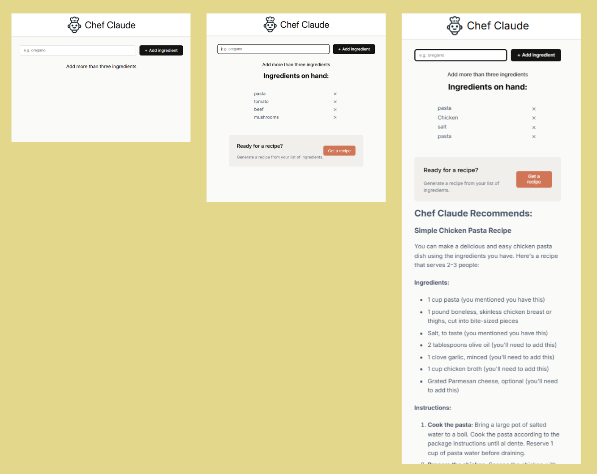

# Chef Claude 🍳


[](https://ivandidenko-chef-claude.netlify.app/)

> Click the image to view the demo. The link will open in the current tab (press `Ctrl + Click` or `Cmd + Click` to open in a new tab).

## Description

**Chef Claude** is an AI-powered recipe generator built with React. Add ingredients you have at home and get a personalized recipe suggestion instantly, powered by AI model via Groq.

This project was created to practice React fundamentals, working with external AI APIs, environment variables, and responsive UI design.

## Features

- **Ingredient Management**:
  - Add ingredients one by one
  - Remove individual ingredients with ✕ button
  - Live list updates with smooth UX

- **AI Recipe Generation**:
  - Generates a recipe from your available ingredients
  - Powered by Groq AI
  - Recipe rendered in clean formatted markdown

- **Loading & Error States**:
  - Button shows "Generating..." while waiting
  - Error messages displayed if API call fails

- **Responsive Design**:
  - Works on desktop and mobile
  - Clean stacked layout on small screens

- **Accessibility** – `aria-live` regions and semantic HTML

## Technologies Used

- **React 18** – Component-based UI library
- **Vite** – Fast build tool and development server
- **Groq API** – AI model API
- **react-markdown** – Renders AI response as formatted markdown
- **CSS3** – Custom styling with flexbox and responsive media queries
- **Google Fonts** – Inter typography

## What I Practiced

- Building and composing functional React components
- Managing state with `useState` and `useEffect`
- Handling async API calls with loading and error states
- Working with environment variables in Vite (`VITE_` prefix)
- Using `useRef` and `scrollIntoView` for smooth scroll UX
- Responsive layouts with Flexbox and media queries
- Keeping API keys secret with `.env` and `.gitignore`
- Deploying to Netlify with environment variable configuration

## Getting Started

### Prerequisites

- Node.js (v18 or higher)
- npm
- Groq account + API key

### Installation

1. Clone the repository:

```bash
git clone https://github.com/yourusername/chef-claude.git
cd chef-claude
```

2. Install dependencies:

```bash
npm install
```

3. Create a `.env` file in the root of the project:

```
VITE_GROQ_API_KEY=hf_your_token_here
```

4. Start the development server:

```bash
npm run dev
```

5. Open your browser and navigate to `http://localhost:5173`
